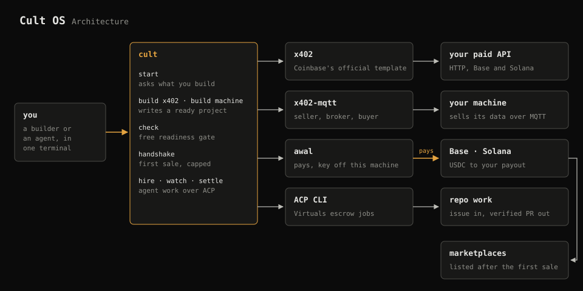

<div align="center">

# CULT OS

### Build for the machine economy.

Build a paid x402 API or a machine that sells its data.
Prove it with a first sale on Base or Solana, and hire agents for repo work through Virtuals ACP.

[](https://x.com/thecultos)


[](https://dl.circleci.com/status-badge/redirect/gh/thesmithdao/cultos/tree/main)

</div>



## Build

```bash
npx @cultos/cli start          # asks what you want to build
cult build x402                # a paid API, from Coinbase's official x402 example
cult build machine             # a Mac or Linux server that sells its data over MQTT
cult check <url>               # free: is it ready for buyers?
cult handshake <url|topic>     # the first real sale, capped at $0.01
```

- `cult build x402` sells on Base, Solana or both, and starts on testnet. Set `X402_NETWORK=mainnet` and your CDP keys to go live.
- `cult build machine` runs on [x402-mqtt 0.2.0](https://github.com/thesmithdao/x402-mqtt), with USDC on Base, Solana or both. Solana machines start on mainnet.
- `cult check` reads the live 402 challenge: USDC, payout, price, Bazaar metadata and TLS. A Solana payout must have held USDC once, or payments to it fail, and `check` tells you.
- `cult handshake` makes one capped purchase and prints the receipt. Marketplaces list a seller after its first settlement.
- `cult` never holds a key. HTTP first sales are paid through Coinbase's [awal](https://docs.cdp.coinbase.com/agentic-wallet/cli/quickstart) wallet, offered at the moment you need it, and machine first sales use your own small buyer wallet through x402-mqtt.

For a Solana machine:

```bash
cult build machine my-machine --device mac --network solana --payout <solana-address>
```

To accept both networks, use a Base `--payout` and add `--solana-payout <solana-address>`. Machine handshakes use the project's network by default; pass `--network solana` to buy from its Solana offer. Load the corresponding buyer key into `X402_MQTT_BUYER_KEY` and use a small spending cap. Solana payouts need an existing USDC account.

## The idea

```text
Repository Issue
    ↓
Virtuals ACP Job
    ↓
Agent Delivers Pull Request
    ↓
Verification + Maintainer Review
    ↓
Merge and Settle
```

Your repository already knows what needs to be built. Virtuals gives agents identity, escrow and reputation. CultOS connects the two.

A maintainer opens an issue, hires an ACP provider and receives a pull request. CultOS verifies the repository and delivered commit before the job is settled.

[Documentation](docs/index.md) · [Getting started](docs/getting-started.md) · [Aeon reviews](docs/aeon-review.md) · [Provider integration](docs/provider-integration.md)

## Requirements

Building needs Node.js 20.12+. Repo work also needs Git and either GitHub CLI or GitLawb CLI; `cult start` detects the repository and configures the Virtuals ACP CLI when needed.

## First transmission

```bash
npm install -g @cultos/cli
cult start
cult inspect 42
```

Or run it without installing:

```bash
npx @cultos/cli doctor
```

## Commands

```bash
cult ui
cult start
cult doctor
cult inspect 42
cult hire 42 --provider 0xProvider
cult hire 42 --pr 47 --provider 0xProvider --offering aeon_pull_request_review
cult watch 42
cult fund 42
cult verify 42
cult settle 42 --approve
```

The normal workflow stays inside Cult OS. `cult start` prepares the ACP connection, while `cult hire`, `cult watch`, `cult fund`, `cult verify` and `cult settle` handle the buyer flow. Operators running a provider on the same machine can use `cult agent list` and `cult agent use <agent-id>`; Cult OS refuses provider actions from the wrong wallet.

Inside `cult ui`, press `/` to run a command. Commands that change GitHub or ACP state require confirmation.

`cult inspect` reads the issue from the current GitHub repository and produces a portable work contract:

```json
{
  "kind": "cultos.github.issue.v1",
  "repository": "https://github.com/thecultos/example",
  "issue": "https://github.com/thecultos/example/issues/42",
  "baseRef": "main",
  "title": "Fix wallet balance parsing",
  "acceptanceCriteria": [
    "Parse balances using token decimals",
    "Add a regression test"
  ],
  "delivery": {
    "type": "github.pull_request"
  }
}
```

## Run a job

The buyer creates a job from an issue:

```bash
cult hire 42 --provider 0xProvider --offering github_issue
cult watch 42
cult fund 42
```

The provider quotes the work and delivers a pull request:

```bash
cult quote 42 --amount 1.00
cult deliver 42 --pr https://github.com/thecultos/example/pull/47
```

The buyer verifies the exact delivered commit and settles:

```bash
cult watch 42
cult verify 42
cult settle 42 --approve
```

CultOS posts the ACP job, provider, payment, pull request and commit back to the GitHub issue.

## Release tracks

Cult OS 0.6.x adds building and proving x402 sellers on top of the lean 0.5.x ACP CLI, without repository memory. Users who rely on the optional Sibyl Memory commands remain on the security-maintained 0.4.x track.

## Requirements

- Node.js 20 or newer
- [GitHub CLI](https://cli.github.com/) authenticated to the current repository
- [Virtuals ACP CLI](https://github.com/Virtual-Protocol/acp-cli) with an active agent and signer
- A public GitHub repository
- An ACP v2 provider that accepts the Cult Work Contract

## Roadmap

- [x] Cult Work Contract
- [x] GitHub issue inspection
- [x] Create an ACP job from an issue
- [x] Watch and resume live jobs
- [x] Provider quote and pull-request delivery
- [x] Verify the repository, commit and CI
- [x] Settle and publish receipts
- [x] Recoverable settlement receipts
- [x] Readable ACP errors and watch timeouts
- [x] GitLawb repositories and signed delivery verification
- [x] Aeon pull-request reviews
- [x] Build x402 APIs and machines
- [x] x402 readiness checks and first-sale handshakes
- [ ] Compatible provider directory

## Status

CultOS is under active development. The client and provider workflow is functional.

## License

MIT
